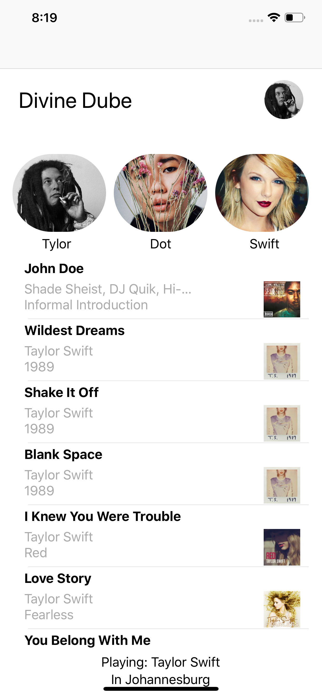

## Songhound

## About

Songhound is an iOS app that help you discover new music and artist based on the area that you are in.

### How it works
It gathers most played songs in a particular area and sorts them by that area also this list is updated everytime a person plays a song their iPhone as long as they have the app installed moreover they don't have to have the app open, sweet stuff!.

You can also login using your google account and set your music preference.

### How its built
 We using the VIPER architecture
 We using itunes music API
 We using Firebase for google login and soon Realtime Database
 NOT using Alamofire for images

#### Future
 Build UI in code
 integrate local storage

### How it looks like(for now )

 
